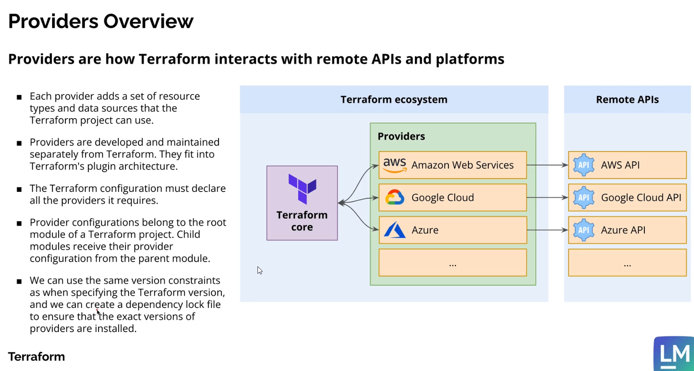

# To create different backends for different environments, we can move the backend content in providers.tf to two different tfbackend files 

> terraform init -backend-config="prod.s3.tfbackend" -migrate-state
> terraform init -backend-config="dev.s3.tfbackend" -migrate-state

